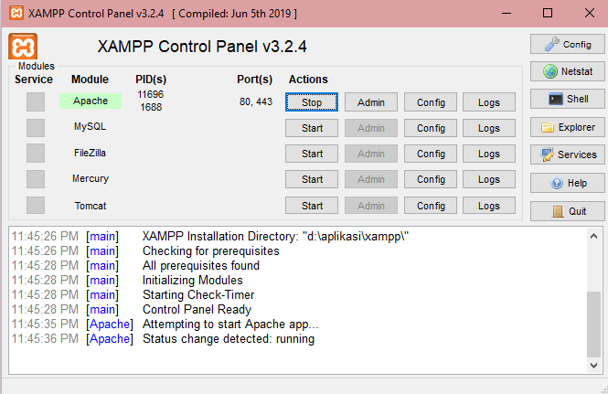
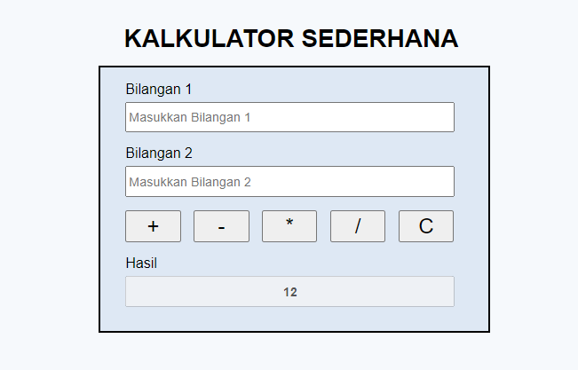
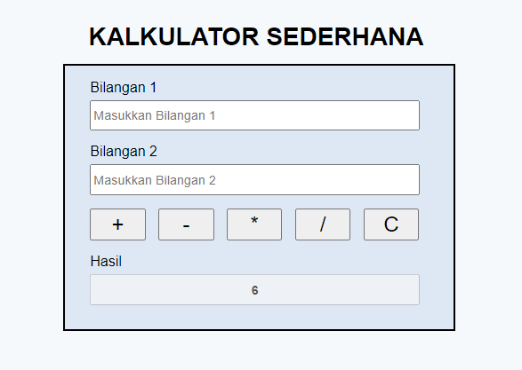
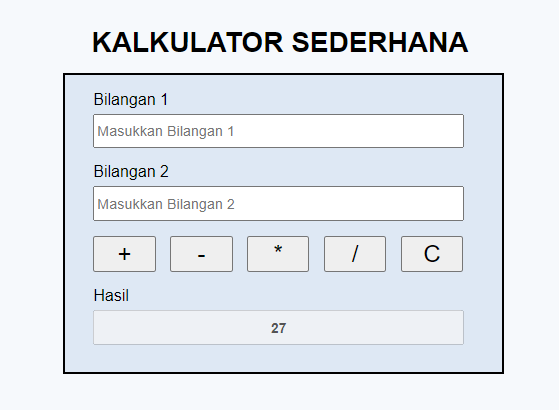
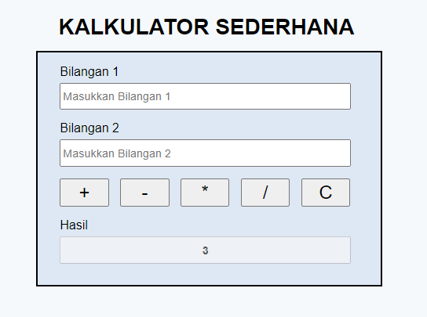
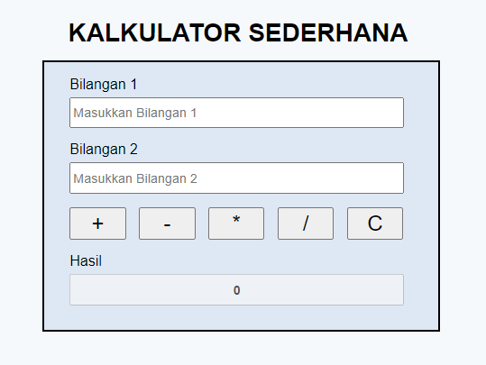

# **Kalkulator Sederhana**

[](https://travis-ci.org/matthiasnoback/badges)
[](https://github.com/Naereen/StrapDown.js)

[](https://github.com/Naereen/badges/)

Implementasi Rancangan User Interface (UI) Kalkulator Sederhana ke dalam kode program HTML, dan CSS. Serta menerapkan pemrograman terstruktur kedalam bahasa pemrograman PHP. Kalkulator Sederhana ini dibuat untuk memudahkan dalam melakukan operasi aritmatika seperti (pertambahan, pengurangan, perkalian, dan pembagian).

# **Requirements**
* Text Editor (Notepad++, Sublime Text, Visual Studio Code, dll)
* Web Server
* Web Browser (Chrome, Mozilla Firefox, Microsoft Edge, Safari, dll)

# **Installation**
1. Lakukan instalasi Text Editor (pilih salah satu)
   * Notepad++ (https://notepad-plus-plus.org/downloads/)
   * Sublime Text (https://www.sublimetext.com/3)
   * Visual Studi Code (https://code.visualstudio.com/download)

2. Lakukan instalasi Web Server (bisa menggunakan [XAMPP](https://www.apachefriends.org/download.html))

3. Lakukan instalasi Web Browser (pilih salah satu)
   * Chrome (https://www.google.com/intl/id_id/chrome/)
   * Mozilla (https://www.mozilla.org/id/firefox/new/)
   * Microsoft Edge (https://www.microsoft.com/id-id/edge)

4. Jika ingin menjadikan repo Kalulator Sederhana sebagai Remote atau menambahkan Kalkulator Sederhana di komputer, anda dapat melakukan clone repository dan simpan pada folder htdocs.
   ```git clone https://github.com/wiwinmafiroh/kalkulator-sederhana.git

5. Buka XAMPP Control Panel, dan klik button star Apache


6. Buka web browser, dan jalankan Aplikasi Kalkulator Sederhana.

# **Usage**
1. Melakukan Operasi Aritmatika (Pertambahan)


2. Melakukan Operasi Aritmatika (Pengurangan)


3. Melakukan Operasi Aritmatika (Perkalian)


4. Melakukan Operasi Aritmatika (Pembagian)


5. Melakukan Clear TextBox


# **Credits**
> Wiwin Mafiroh
